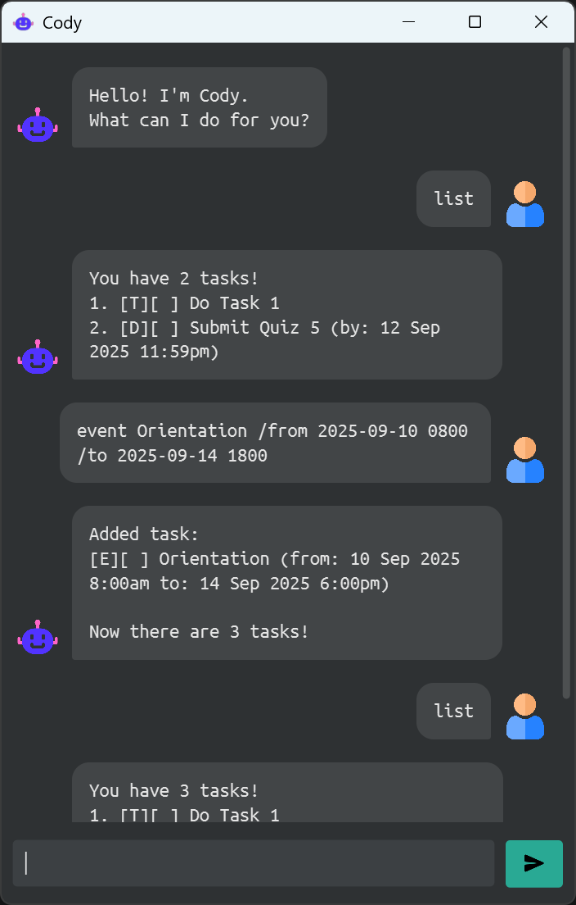

# Cody User Guide

Help manage your day with Cody! Cody is a personal assistant designed to help you organize tasks, set reminders, and keep track of your schedule.

---

## Quick start

1. Ensure you have Java `17` or above installed in your Computer.

2. Download the latest `.jar` file from [here](https://github.com/CZX123/ip/releases/latest).

3. Copy the file to the folder you want to use as the _home folder_ for managing your tasks.

4. Double-click the `cody.jar` file to run the app.

   - If that doesn't work, open a command terminal, `cd` into the folder you put the `jar` file in, and use the `java -jar cody.jar` command to run the application.

5. Type a command in the command box and press Enter to execute it.
Some example commands you can try:

- `todo Finish assignment` : Adds a todo with description "Finish assignment" to the task list.

- `list` : Lists all tasks.

- `mark 1` : Marks the first task in the list as done.

- `edit 1 /desc Submit quiz` : Renames the description of the first task to "Submit quiz".

- `delete 1` : Deletes the first task in the list.

- `exit` : Exits the app.

Refer to the features below for details of each command.

---

## Features

> [!NOTE] Notes about the command format.
> - Words wrapped in angle brackets (e.g. `<...>`) are values to be supplied by the user.
> 
>   e.g., `todo <description>` could be `todo Finish assignment`.
> 
> - Items in square brackets (e.g. `[...]`) are optional, unless specified otherwise.
> 
>   e.g. `<index> [/from <YYYY-MM-DD HHmm>]` can be used as `3 /from 2023-10-01 1800` or just `3`.
> 
> - All dates and times are to be written in the format `YYYY-MM-DD HHmm` (e.g., `2023-10-01 1800` for 6pm on 1st October 2023).
> 
> - All commands are lowercase, any uppercase letters will be treated as invalid command.
> 
> - Extraneous parameters for commands that do not take in parameters (such as `exit` and `bye`) will be ignored.
> 
>   e.g. if the command specifies `exit 123`, it will be interpreted as `exit`.
> 
> - If you are using a PDF version of this document, be careful when copying and pasting commands that span multiple lines as space characters surrounding line-breaks may be omitted when copied over to the application.

### Adding a Todo: `todo`

Adds a task of type Todo to the task list. It only includes a description.

Format: `todo <description>`

Examples:
- `todo Finish assignment`
- `todo Buy groceries`

### Adding a Deadline: `deadline`

Adds a task of type Deadline to the task list. It includes a due date and time as well.

Format: `deadline <description> /by <YYYY-MM-DD HHmm>`

Examples:
- `deadline Submit report /by 2023-10-15 2359`
- `deadline Pay bills /by 2023-10-01 1200`

### Adding an Event: `event`

Adds a task of type Event to the task list. It includes starting and ending dates and times for the event.

Format: `event <description> /from <YYYY-MM-DD HHmm> /to <YYYY-MM-DD HHmm>`

Examples:
- `event Team meeting /from 2023-10-05 1400 /to 2023-10-05 1500`
- `event Birthday party /from 2023-10-20 1800 /to 2023-10-20 2100`

### Listing all tasks: `list`

Shows a list of all added tasks.

Format: `list`

### Listing tasks occurring on specific date: `list <date>`

Shows a list of added tasks that occurs on the specified date.
- A task only occurs on a date if:
  - for Todo: it never occurs on any date, so no Todos will be shown
  - for Deadline: its due date is the specified date
  - for Event: the specified date is within the start and end dates (inclusive)

Format: `list <YYYY-MM-DD>`

Examples:
- `deadline Submit report /by 2023-10-15 2359` followed by `list 2023-10-15` will show the added deadline.
- `todo Finish assignment` followed by `list 2023-12-25` will show no results.

### Finding tasks by name: `find`

Shows a list of tasks whose descriptions contain the specified keyword.
- The current search is quite basic, and only matches exact case-sensitive keyword given, including spaces.

Format: `find <keyword>`

Examples:
- `todo Finish assignment` followed by `find assignment` will show the added todo.
- `todo Finish assignment` followed by `find meeting` will show no results.

### Marking a task as done: `mark`

Marks the task at the specified index in the task list as done.

> [!TIP] Notes about the index
> - The index refers to the index of each task shown in the `list` command, starting from 1.
> - To reduce confusion, no index is shown when using the `find` or `list <date>` commands, so any task modification command (e.g. `mark`, `unmark`, `delete`, `edit`) should only be used after using the `list` command.

Format: `mark <index>`

Examples:
- `todo Finish assignment` followed by `mark 1` will mark the added todo as done.
- `todo Finish assignment` followed by `mark 3` will show an error as there is no task with index 3.

### Marking a task as not done: `unmark`

Marks the task at the specified index in the task list as not done.

Format: `unmark <index>`

Examples:
- `unmark 2`
- `unmark 5`

### Deleting a task: `delete`

Deletes the task at the specified index in the task list.

Format: `delete <index>`

Examples:
- `delete 4`
- `delete 1`

### Editing a task: `edit` or `update`

Edits the details of the task at the specified index in the task list. The edit format will depend on the type of task being edited.
>[!NOTE] Note: `update` is an alias for `edit`, using either command will edit the task.

Format:
- For Todo: `edit <index> /desc <description>`

- For Deadline: `edit <index> [/desc <description>] [/by <YYYY-MM-DD HHmm>]`
  > [!IMPORTANT] Note: At least one of `/desc` or `/by` must be provided when editing a Deadline.

- For Event: `edit <index> [/desc <description>] [/from <YYYY-MM-DD HHmm>] [/to <YYYY-MM-DD HHmm>]`
  > [!IMPORTANT] Note: At least one of `/desc`, `/from` or `/to` must be provided when editing an Event.

Note that the order of the parameters does not matter, just that at least one of the parameters must be provided.

Examples:
- `todo Finish assignment` followed by `edit 1 /desc Submit quiz`
  - The result will show that the description of the added todo has been changed to "Submit quiz".
- `deadline Submit report /by 2023-10-15 2359` followed by `edit 1 /by 2023-10-20 2359`
  - The result will show that the due date of the added deadline has been changed to "2023-10-20 2359".
- `event Team meeting /from 2023-10-05 1400 /to 2023-10-05 1500` followed by `edit 1 /desc Project meeting /from 2023-10-05 1500 /to 2023-10-05 1600`
  - The result will show that the description, start date and end date of the added event has been changed to "Project meeting", "2023-10-05 1500" and "2023-10-05 1600" respectively.

### Exiting the program: `exit` or `bye`

Exits the program.
>[!NOTE] Note: `bye` is an alias for `exit`, using either command will exit the program.

Format: `exit`

### Saving the data

Cody's data are saved in the hard disk automatically after any command that changes the data. There is no need to save manually.

### Editing the data file

Cody's data are saved automatically as a TXT file `[JAR file location]/data/tasks.txt`. Advanced users are welcome to update data directly by editing that data file.
> [!WARNING] Caution about editing the data file
> - If your changes to the data file makes its format invalid, Cody will show an error when it next starts up. Any subsequent edits will override the invalid data file, causing you to lose your data.
> - It is recommended that as soon as an error occurs when loading the tasks, you should close Cody and edit the data file to fix the error, or backup the data file and add the tasks back using Cody commands.
> - Furthermore, certain edits can cause Cody to behave in unexpected ways (e.g., if a value entered is outside the acceptable range). Therefore, edit the data file only if you are confident that you can update it correctly. 